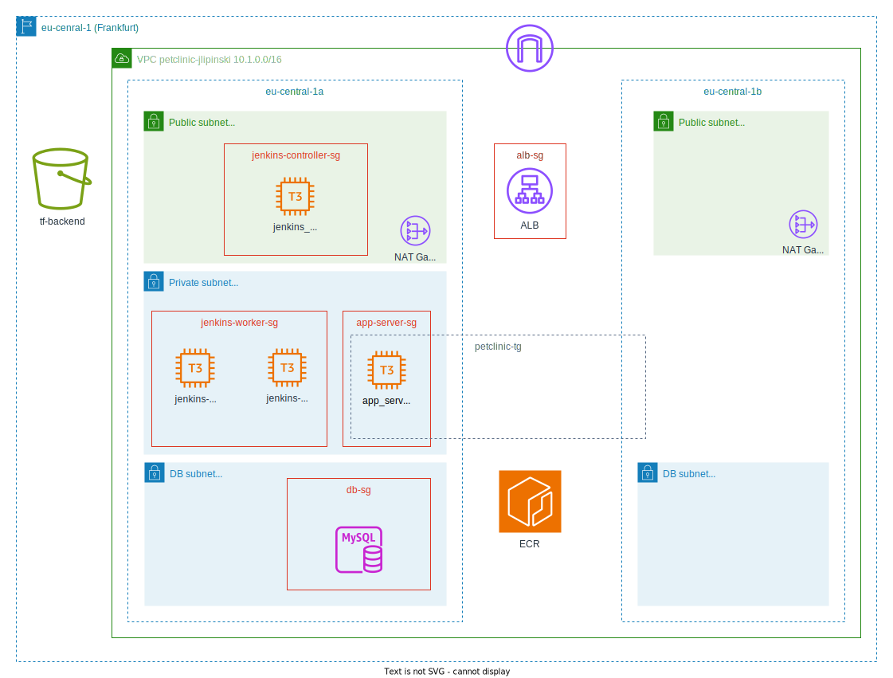
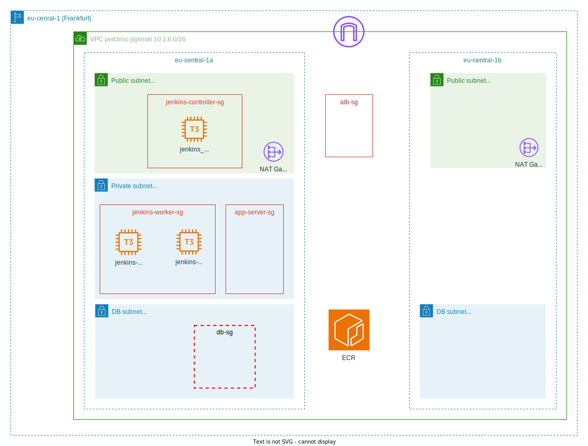

# DevOps Internship Capstone Project
Whole project consists of three repositories:
- Pre-setup (this repo)
- Continous Integration repository
- Petclinic application repository
# Pre-setup Repository

This repo contains configuration-as-code for a Petclinic app CI/CD solution. 
It uses Terraform for provisioning infrastructure in AWS cloud. Before the first run it needs some basic manual configuration:
- installing and configuring AWS CLI locally
- setting an AWS Region in `variables.tf`
- setting Terraform backend S3 and Dynamo-DB config in `providers.tf`
- providing ssh keys for for servers in files/secrets (there is a script `files/generate-keys.sh` which can generate keys using ssh-keygen and store them in a location proovided with $1 argument)
- providing github token which allows Jenkins Githubb Plugin to connect with Petclinic repo (`files/secrets/ght-token`)

### Full application deployment

### Resources provisioned with this repo
